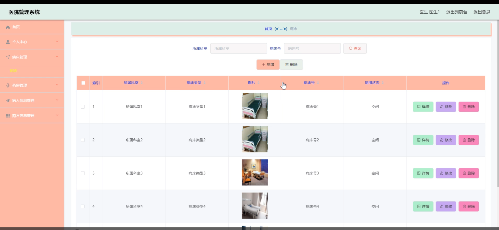

# 基于springboot的医院管理系统

<h4 style='color:red'>联系不到我，就看我的主页 </h4> 
 
#### 介绍

在当今快节奏的医疗环境中，有效的管理是提高医疗服务质量、优化资源配置和确保患者满意度的关键。为此，我们开发了基于Spring Boot框架的医院管理系统。该系统不仅具备高度的灵活性和可扩展性，还通过模块化设计，满足了医院管理中不同角色的多样化需求。无论是管理员、护士还是医生，都能通过该系统高效地完成日常工作，从而提升医院整体运营效率。

#### 技术栈

后端技术栈：Springboot+Mysql+Maven

前端技术栈：Vue+Html+Css+Javascript+ElementUI

开发工具：Idea+Vscode+Navicate

#### 系统功能介绍

1. 个人中心

功能描述：管理员的个人信息管理模块，允许管理员查看和修改自己的个人信息，如用户名、密码、联系方式等。这一模块保证了管理员账号的安全性，便于管理员进行个性化的账户设置。    
2. 医生管理

功能描述：负责管理医生的基本信息，如姓名、职称、所属科室等。同时，还可以进行医生的排班管理、权限设置等操作，确保医生资源的合理分配和高效利用。  
3. 护士管理  

功能描述：与医生管理类似，护士管理模块负责管理护士的基本信息、排班和权限。通过这一模块，医院可以清晰地掌握护士的工作状态，确保护理工作的顺利进行。  
4. 病床类别管理  

功能描述：定义和管理医院内不同类别的病床，如单人间、双人间、ICU等。管理员可以根据医院实际情况设置病床类别，并对其进行调整和优化，以满足不同病人的需求。  
5. 药品类别管理    

功能描述：管理药品的分类信息，如处方药、非处方药、中药等。管理员可以通过该模块了解药品的分类情况，并对药品的库存和使用情况进行监控和管理。
6. 科室信息管理    

功能描述：管理医院的科室信息，包括科室名称、负责人、位置等。通过这一模块，管理员可以清晰地了解医院的科室结构和布局，便于进行科室间的协调和合作。  
7. 内部论坛  

功能描述：提供一个内部交流和讨论的平台，供管理员、医生和护士分享工作经验、交流病例信息等。这一模块促进了医院内部的团队协作和知识共享。  
8. 系统管理  

功能描述：包括用户管理、权限管理、日志管理等。管理员可以通过这一模块对系统用户进行添加、删除、修改等操作，并设置用户的权限范围。同时，系统还会记录用户的操作日志，确保系统的安全和稳定运行。  
二、护士端功能模块  
1. 内部论坛    

功能描述：与管理端的内部论坛相似，护士可以通过该模块与医生和管理员进行内部交流和讨论。    
2. 医院公告    

功能描述：查看医院发布的最新公告和通知，了解医院最新的政策和动态。  
3. 个人中心  

功能描述：查看和修改护士的个人信息，如姓名、联系方式等。  
4. 后台管理  

病床管理：查看和管理医院内的病床使用情况，包括病床的空闲状态、病人入住情况等。   
药房管理：查看药品库存、申请领药等，确保药品的及时供应和合理使用。  
病人信息管理：录入、查询和修改病人的基本信息，如姓名、年龄、病情等。  
药方信息管理：为病人开具药方、查看药方历史等，确保病人得到正确的药物治疗。  
三、医生端功能模块  
1. 内部论坛  

功能描述：与管理端和护士端的内部论坛相似，医生可以通过该模块与护士和管理员进行内部交流和讨论。
2. 医院公告  

功能描述：查看医院发布的最新公告和通知，了解医院最新的政策和动态。
3. 个人中心  

功能描述：查看和修改医生的个人信息，如姓名、职称、所属科室等。
4. 后台管理  

病床管理：查看医院内的病床使用情况，为病人安排合适的床位。  
药房管理：查看药品库存、为病人开具处方等，确保病人得到正确的药物治疗。  
病人信息管理：查看和修改病人的基本信息、诊断结果等，为病人提供专业的医疗服务。  
药方信息管理：查看自己开具的药方历史、修改药方等，确保药方信息的准确性和完整性。  

#### 系统作用

1. 提高管理效率

医院管理系统通过自动化的管理流程和模块化的功能设计，大大减轻了医院管理人员的工作负担。各项管理工作都能在系统内高效完成，避免了繁琐的手动操作和数据录入，从而提高了管理效率。

2. 优化资源配置

系统可以实时监控医院的病床、药品等资源的使用情况，帮助医院做出更合理的资源配置决策。通过数据分析，医院可以更加精准地预测资源需求，提前进行资源调配，确保资源的充分利用和避免浪费。

3. 提升服务质量

通过系统化管理，医院可以更加规范地处理病人的信息、药方等，减少了人为错误的可能性。医生和护士可以更加便捷地获取病人的病历信息和医嘱信息，为病人提供更加准确、及时的医疗服务。同时，系统还可以自动提醒医生和护士完成病人的检查、治疗等任务，确保病人得到全面的照顾和关怀。

4. 加强内部沟通

内部论坛和医院公告等功能模块为医院内部人员提供了一个交流和沟通的平台。医生和护士可以在论坛上分享工作经验、交流病例信息等，促进团队协作和知识共享。医院公告则可以将最新的通知和信息及时传达给所有员工，确保医院内部的信息畅通和一致。

#### 系统功能截图

代码结构

数据库表

内部论坛

医生端后台管理

病床管理

病房管理

病人信息管理

药方信息管理

护士端后台管理

护士管理

管理员个人信息

前台页面个人中心

#### 总结

综上所述，本医院管理系统基于Spring Boot框架开发，具备高度的灵活性和可扩展性。通过模块化的功能设计和先进的技术支持，系统为医院管理提供了全面的解决方案。无论是提高管理效率、优化资源配置还是提升服务质量、加强内部沟通方面，该系统都发挥了重要作用。未来，我们将继续完善和优化系统功能，为医院管理提供更加高效、便捷的服务。

#### 使用说明

创建数据库，执行数据库脚本 修改jdbc数据库连接参数 下载安装maven依赖jar 启动idea中的springboot项目

后台地址：http://localhost:8080/springboot3v5bn/admin/dist/index.html

管理员  abo 密码 abo

前台地址：http://localhost:8080/springboot3v5bn/front/index.html

